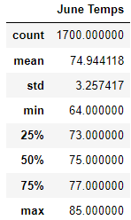
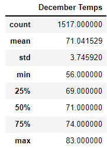

# surfs_up

## Overview

Data on the Hawaiian island of Oauhu's weather during the hot and cold season is needed to determine the viability of an outdoor business. In order to determine the key differences in Oahu's weather during the months of June and December, SQLAlchemy is used to query a SQLite database. 

## Results

  

- While December has a lower average temperature than June, the difference is not significant enough to hinder potential business ventures on the island (74.9 vs 71)
- Although Oahu's average temperature during June and December does not greatly differ, their ranges do. While June has a temperature range of only 21 degrees (max=81, min=64), December has a range of 27 degrees (max=83, min=56). Spefically, December's minimum temperature indicates that an outdoor business could _potentially_ run into issues.
- Both June and December have standard deviations of less than 4 degrees. Given their mean temperatures, it can be determined that exceedingly low temperatures are quite rare, and are outliers within the data. Therefore, while it is possible for Oahu's temperature ot dip into the 50's during December, it should not be considered a common occurence and should not deter potential outdoot business owners from establishing themselves on the island. 

## Conclusion 

